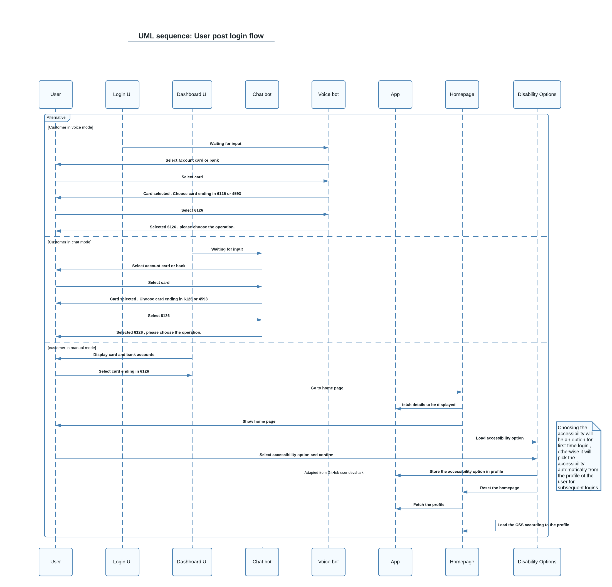

# Next Gen Accessibility product

<!--- Template Instructions  
  Update the Story Title and remove the warning below.
--->

 Before submitting your project repo, modify template as desired and remove all inline  Template Instructions. 

<!--- Template Instructions  
  Organize TOC to meet needs or project
--->
#### Table of Contents
- [Next Gen Accessibility](#use-case-story-title) 
      - [Table of Contents](#table-of-contents)

  - [Business Challenge](#business-challenge)
    - [Concept](#concept)
    - [Approach](#approach)
  - [Vernacular](#vernacular)
  - [Assumptions](#assumptions)
  - [Persona](#persona)
  - [Story](#story)
  - [Demo Workflow](#demo-workflow)
    - [Step 1](#step-1)
    - [Step 2](#step-2)

 
## Business Challenge
<!--- Template Instructions   
  Briefly describe the business challenge addressed by this use case story. Design Thinking exercises aid in the development of a clear problem statement. 
--->
 Impaired persons feel difficulties in navigating through the websites or mobile apps. Challenge is to address the accessibility requirements for Impaired persons on a finance institution's website while providing a seemless user experience with different tools. 
### Concept
<!--- Template Instructions   
  Briefly describe how this use case applies Atomic Accessibility Design to the business challenge. Leverage Design Thinking exercises to aid in this endeavor. 
--->
 The concept of providing a URL (accessibility.discover.com) or an accessibility app which mirrors discover website functionality along with accessibility features with the product Next Gen Accessibility. This product will provide multiple tools like voice bot , chat bot, accessible keyboard and accessibility options panel to the impaired users so that they can get a seemless experience in the website without any difficulties.
### Approach
<!--- Template Instructions   
  Describe the end to end interactions of the stakeholders that are pertinent to this use case story. Leverage Design Thinking exercises to aid in this endeavor. 
--->

 
## Vernacular
<!--- Template Instructions   
  List and describe any terms that will be used in the story and referenced in diagrams. The current list provides a sample starter list. Leverage Design Thinking exercises to aid in the identification of use case archetypes. 
--->
 
1. **Impaired Person**: A content consumer with one or more disabilities or disorders. Needs to be able to interact with accessible content to achieve goals.
2. **Designer**: Defines consistent design language components and style. Needs to be able to create accessible styling for content creators and developers with minimal effort.
3. **Developer**: Implements design language in software systems that generate content. Needs to be able to create accessibly inclusive renderings with ease.
4. **Content Creator**: Utilizes the design language to produce consistently styled content. Needs to publish accessible content without extra steps or effort.
5. **Content Publishing System**: Any system that consumes artifacts from an accessible theme builder to produce physical or digital content that is accessibly compliant. 
 

## Assumptions
<!--- Template Instructions   
  List any assumptions to be considered in this use case story.  Leverage Design Thinking exercises to aid in this endeavor. 
--->
 
1. *Enter assumption text ...*
2. *Enter assumption text ...*
 
## Persona
<!--- Template Instructions   
  Using the sample persona images in the /images/persona folder, describe the roles of the entities involved in this use case story. The current list provides a sample starter list. 
--->
 
| Actor | Role | Goals | Details |
| --- | --- | --- | --- |
|  | Financial Institution, Content Creator | Generate accessibly complaint content. |  |  
|   Acme Enterprise |  |  |  |
|  Angelica | Designer |  |  | |
|  Darius | Impaired Person |  |  | |
|  Atomic Accessibility Design Tool | Theme Builder |  | |
 
## Story
<!--- Template Instructions   
  Using the sample persona images in the /images/persona folder, describe the steps that are involved in the interactive use case story. The story below is offered as an exemplar.
--->

_Below story show how a visually impaired banking customer perform a specific task with the help of accessible chatbot._

## Demo Workflow
<!--- Template Instructions   
  Using the sample persona images in the /images/persona folder, describe the steps of the use case story as they relate to one or more UML Sequence Diagrams.  
--->
 
### Login
 

### Post Login
 

### Pay Card with Voice bot
 

### Pay Card with Chat bot
 

### Pay Card with Manual
 

 
 
