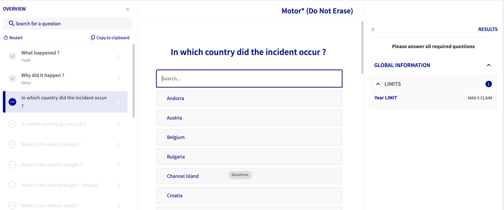

# Computable Contracts for Global Accessibility Awareness Day Hackathon.

Computable Contracts is a technology developed by AXA. Computable Contracts are digital twins of the paper contract and as such, we can run computations on these contracts to, for example, know whether a given situation is covered or not by the insurance policy and if to which amount.

For the [hackathon](https://www.finos.org/hosted-events/2023-05-18-gaad-hackathon) we are giving you access to the data structure and to the interpreter through a public interface, the `computation` API. We are providing three already modeled products with the original legal text.

The purpose of this [hackathon](https://www.finos.org/hosted-events/2023-05-18-gaad-hackathon) is to promote the design of accessible inclusive digital and physical financial assets and tools.

With Computable Contracts, we are proposing an implementation of the [Legal Specification Protocol (LSP)](https://law.stanford.edu/publications/developing-a-legal-specification-protocol-technological-considerations-and-requirements/). The LSP consists of three main elements:
1.  a user interface that should be easy to use for non-technical users
2.  a data structure that represents the legal document
3.  and an interpreter who can run computations on the data structure

Therefore, we have created a tenant (see connection information below) populated with these products. If you want to see the digital representation of the contract, you can use the `v3` version of the API which optionally provides the computation graph of the computable contracts in the `rules` property (`compiled-products` endpoint).

Using the `v4` for version of the API, you get access to the computation endpoint, which will list all the questions that are necessary to ask to find out if a situation is cover or not. We provide some payload examples below. 

## Documentation
* [v3](https://productmodeler.axa.com/api/v3/docs)
* [v4](https://productmodeler.axa.com/api/v4/docs)

## Connection information
For the duration of the hackathon, use the following information to connect to the API 

* tenant: `finos-hackaton`
* api token: `48y0aydixg267anzrlystlisx6n5fde9bxedf3hsihhqvwjk2bcfez3lle5ho8mu1yqw8mrlr4g26519iug77mwh2j1w35fb7421e0msp6gmu1ymqjrunu8mun31msulqb4teuxxvk42kv2ehgj55fbmm6dzqtf7r3vpwugu7fp0e8rtb5yfjijlmu36o9pwoeh29sjfnusl7bnvhj52hgfmwfxed8pfmjdx4b8fpm9m7um8bmua79lr46yo26eehznepslkufqylj91ewy0jjwrxwz24tpce212shkfu5ky0gylp77j6vesu0o`


Product text and ids: 
* [Motor](./policies/motor.pdf): 162306 | motor
* [Coop](./policies/coop.pdf): 162305 | coop
* [Coverwise](./policies/coverwise.pdf): 162304 | coverwise

Both the numerical and string ids are valid ids.

## Payload examples
Here is an example of a minimal payload:
```json
{
  "productId": "162306",
  "release": null,
  "policy": {
    "endorsements": []
  },
  "match": [],
  "claim": {
    "lines": [
      {
        "state": []
  }
}
```
Sending a payload with an empty state will return a full list of questions in order to drive the claim. The response will contain additional information concerning the product, but the the main information in order to populate the state will be found in the `questions` property:

```json
"questions": [
    {
      "allowMultiplePerClaim": false,
      "id": "EVENT",
      "answers": [
        {
          "id": "EV0011",
          "primaryKey": "EV0011",
          "displayName": "Accident",
          "priority": 1,
          "columns": {
            "id": "EV0011",
            "Category": "Breakdown",
            "en": "Accident",
            "fr": "Accident"
          }
        },
        {...}, // truncated
        {
          "id": "_OTHER",
          "displayName": "Other",
          "priority": 17
        }
      ],
      "lineRef": "root",
      "metadata": [
        {
          "key": "question",
          "value": "What happened ?"
        }
      ],
      "possibleAnswers": [
        "EV0011"
      ],
      "priority": -1,
      "source": "MAIN",
      "response": "EV0011",
      "type": "enum",
      "order": 0
    },
```
Each question need an to be answered in order to receive a coverage or an exclusion. It is best to answer question one by one as depending on the situation a question might not be relevant anymore and might lead to an `OUT_OF_SCOPE` situation. In order to populate the `state` array it is necessary to use the `id` of the question and the selected answer. The following example shows a payload with the populated state.

```json
{
  "productId": "162306",
  "release": null,
  "policy": {
    "endorsements": []
  },
  "match": [],
  "claim": {
    "lines": [
      {
        "state": [
          {
            "id": "EVENT",
            "value": "EV0011",
            "order": 0
          },
          {
            "id": "TRIGGER_EVENT",
            "value": "_OTHER",
            "order": 1
          }
        ],
        "line_ref": "root"
      }
    ]
  },
  "ignoreTriggers": false,
  "onlyNext": false
}
```

This API can be used to create user interface and lead the question response process such as this UI:



But can also be used to lead a the discussion in a voice bot or anything else you can imagine. 